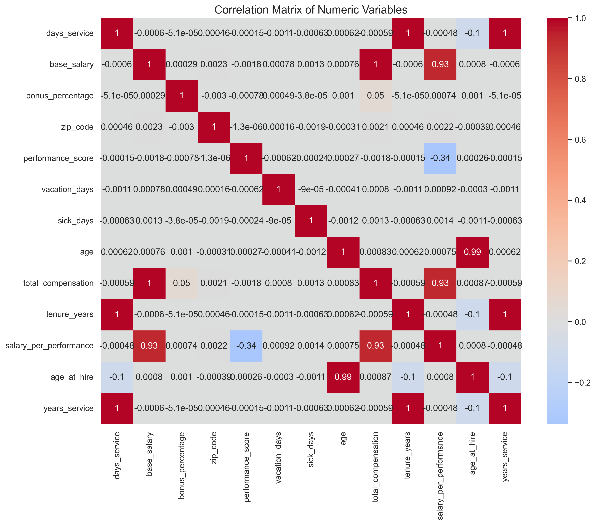
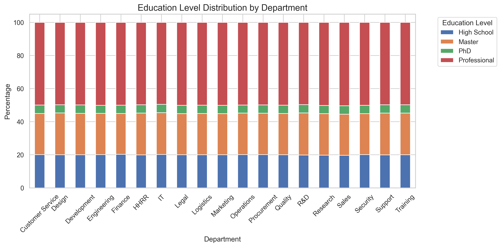

# Employee Data Analysis

This project provides a comprehensive set of tools for analyzing and visualizing employee data, enabling valuable insights into the workforce.

## Visualizations and Analysis

### 1. Salary Distribution


**Conclusions to complete:**
- Analyze distribution shape (normal, skewed, etc.)
- Identify salary outliers or groups
- Compare mean vs median to understand symmetry

### 2. Department Analysis


**Conclusions to complete:**
- Departments with highest/lowest average salaries
- Relationship between department size and salaries
- Performance patterns by department

### 3. Performance-Salary Relationship


**Conclusions to complete:**
- Strength of correlation between performance and salary
- Identification of under/overpaid employees
- Differences by department

### 4. Tenure Distribution


**Conclusions to complete:**
- Employee retention patterns
- Identification of main cohorts
- Potential turnover points

### 5. Gender Distribution by Department


**Conclusions to complete:**
- Gender balance by department
- Identification of departments with low diversity
- Trends in gender representation

### 6. Age Distribution by Gender


**Conclusions to complete:**
- Comparison of age distributions between genders
- Identification of generational gaps
- Age and gender hiring patterns

### 7. Correlation Matrix


**Conclusions to complete:**
- Main positive and negative correlations
- Variables with highest impact on salary
- Unexpected relationships between variables

### 8. Salary vs Experience by Gender


**Conclusions to complete:**
- Analysis of gender pay gap
- Salary evolution with experience
- Differences in growth slopes

### 9. Education by Department


**Conclusions to complete:**
- Predominant educational levels by department
- Relationship between education and department type
- Professional development opportunities

### 10. Education-Salary Relationship Analysis


**Conclusions to complete:**
- Impact of education level on salary distribution
- Correlation strength between education and compensation
- Salary differences between educational levels
- Return on investment for higher education
- Potential areas for targeted compensation adjustments

## Code Usage

To generate these analyses, use the classes provided in the project:

```python
from data_algorithms.data_parser import EmployeeDataParser
from data_algorithms.data_analyzer import EmployeeDataAnalyzer
from data_algorithms.data_visualizer import EmployeeDataVisualizer

# Load and process data
parser = EmployeeDataParser('path_to_data.csv')
data = parser.load_data()
data = parser.clean_data()

# Create visualizations
visualizer = EmployeeDataVisualizer(data)
visualizer.plot_salary_distribution()
visualizer.plot_department_analysis()
# ... etc
```

## Next Steps

1. Add predictive analytics for:
   - Employee turnover prediction
   - Salary growth projection
   - High-potential employee identification

2. Implement time series analysis for:
   - Hiring trends
   - Salary evolution
   - Promotion patterns

3. Develop interactive dashboards for:
   - Real-time monitoring
   - Department-specific analysis
   - HR KPI tracking

## Testing

The project includes comprehensive unit tests for all visualization components. To run the tests:

```bash
pytest tests/
```

For test coverage report:

```bash
pytest --cov=data_algorithms tests/
```

## Requirements

- Python 3.7+
- pandas
- numpy
- matplotlib
- seaborn
- pytest (for testing)
- pytest-cov (for coverage reports)

## Installation

```bash
pip install -r requirements.txt
```
